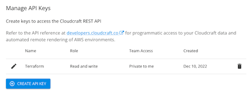

# Observability as Code
What is Observability as Code (OAC)? 
OAC allow you to configure observability components (dashboards, alerts, tracing) through definition files rather than interactive configuration such as the Datadog UI. As this can be version controlled it enables standardization and replication of observability.

It all us to view and observe services and business processes across your/our company.

OAC allows us to deploy observability components using CI/CD principles (auditability, security, maintainability)

This example demonstrates how to use terraform with the following providers:
* Datadog
* AWS
* Cloudcraft (TBC) 

## Datadog eCommerce Application

We use Datadog's eCommerce example to demostrate applying observability principals to an eCommerce app.
More information can be found [here](https://github.com/datadog/ecommerce-workshop)

## Prerequisites

* [AWS Account](https://aws.amazon.com/free/)
* [Datadog Account](https://app.datadoghq.com/signup)
* [HashiCorp Terraform 1.3+](https://www.terraform.io/downloads.html)
* [CloudCraft Pro Account](https://cloudcraft.co/)

### AWS

1. Install the [AWS CLI](https://docs.aws.amazon.com/cli/latest/userguide/getting-started-install.html)
2. Create an IAM User with administration access (NOT FOR USE IN PRODUCTION)
3. Create a configuration and credential file - [AWS Documentation](https://docs.aws.amazon.com/cli/latest/userguide/cli-configure-files.html)
    ```shell
    [default]
    aws_access_key_id = YOUR_AWS_ACCESS_KEY_ID
    aws_secret_access_key = YOUR_AWS_SECRET_ACCESS_KEY

    [aws-im-demo]
    aws_access_key_id = ANOTHER_AWS_ACCESS_KEY_ID
    aws_secret_access_key = ANOTHER_AWS_SECRET_ACCESS_KEY
    ```

### Datadog

1. Create [API](https://app.datadoghq.com/organization-settings/api-keys) & [Application](https://app.datadoghq.com/organization-settings/application-keys) Keys for terraform to use.
2. Create environment varaibles for both API & Application Keys
    ```shell
    export TF_VAR_dd_api="<INSERT_KEY>"
    export TF_VAR_dd_app="<INSERT_KEY>"
    ```

### Cloudcraft
1. Create an API key for terraform to use. API needs both Read/Write Access

    

2.  Create environment varaibles for cloudcraft api
    ```shell
    export TF_VAR_cc_api="<INSERT_KEY>"

### Terraform
Recomdation is to use [Homebrew](https://brew.sh/) to install Terrafrom if using OSX
1. Install terraform using `brew`
   ```shell
   brew install terraform
    ```
2.  Verify that terraform is installed
    ```shell
    terraform -version
    ```

## Deploy eCommerce Application + Datadog + Cloudcraft
Now the fun bit! Once you have compelted all the prerequisites we can prepare our `terraform.tfvars`
Change the following line to match your profile setup in the AWS credential file 
```shell
aws_creds_profile = "aws-im-day"
```
By default we deploy into `eu-west-1`. You can change this by changing `region = "<REGION>"`

Now we run Terraform! 
1. In the current working directory of this repo run `terraform init`. This command performs several different initialization steps in order to prepare the current working directory for use with Terraform.
    ```shell
    terraform init
    ```
    If successful you should see the following output:
    ```shell
    Terraform has been successfully initialized!

    You may now begin working with Terraform. Try running "terraform plan" to see any changes that are required for your infrastructure. All Terraform commands should now work.
    ```
2.  The `terraform plan` command creates an execution plan, which lets you preview the changes that Terraform plans to make to your infrastructure. By default, when Terraform creates a plan it:

* Reads the current state of any already-existing remote objects to make sure that the Terraform state is up-to-date.
* Compares the current configuration to the prior state and noting any differences.
* Proposes a set of change actions that should, if applied, make the remote objects match the configuration.*

    Run terraform plan
    ```shell
    terraform plan
    ```
   You should see what terraform will create if its excuted
   ```shell
    Plan: 36 to add, 0 to change, 0 to destroy.
   ``` 
3. Finally allow terraform to provision AWS, Datadog & Cloudcraft
   The `terraform apply` command executes the actions proposed in a Terraform plan which we saw above.
   ```shell
   terraform apply
   ```
   You will be asked if you wish to proceed; type `yes`

   Terraform will now provision all related resources - This can take up to 5 minutes. 

   Once completed you should see the following output:
   ```shell
    instance_id = "i-064344294e37d43d9"
    instance_public_ip = "54.74.71.204"
    storedog_url = "http://54.74.71.204:3000"
    ssh_command = "ssh -i credentials/ecommerceapp.pem ec2-user@54.74.71.204"
    ```
    This provides you a couple of outputs:
    * AWS Instance ID
    * Public IP address of the AWS instance
    * Public Storedog URL
    * SSH Command to access the AWS Instance 


### (Optional) Delete Resources
To save on costs you can delete all provisioned resources with a simple command
```shell
terraform destroy
```

## Datadog UI
TODO
Datadog provider will be used for configuring dashboards, monitors, and tracing.

## Cloudcraft
TODO